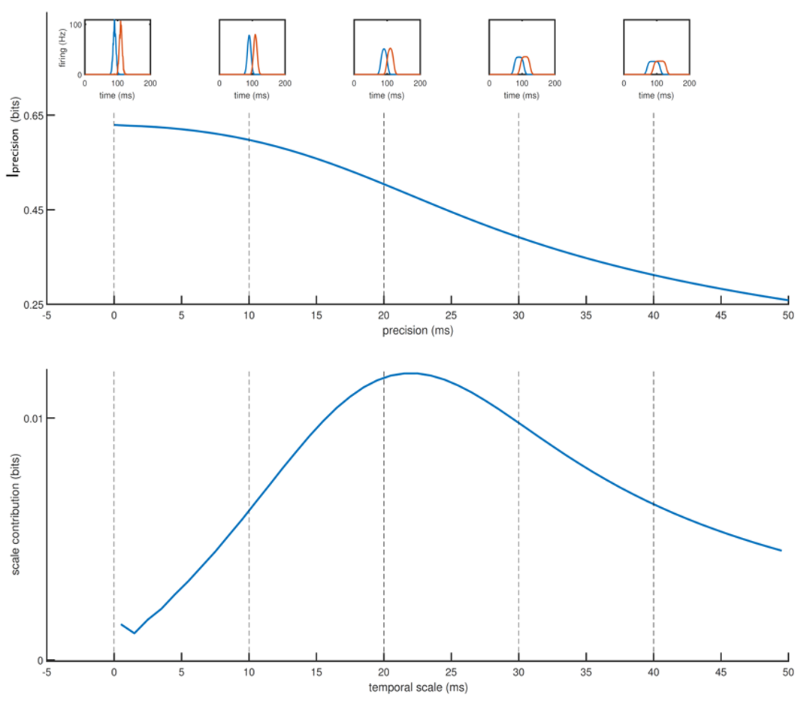

# IJD

Matlab implementation of the Information Jitter Derivative method. 

### Authors
* [Manuel Molano](https://github.com/manuelmolano).

*This work has received funding from the European Union's Horizon 2020 research and innovation programme under the Marie Sklodowska-Curie grant agreement No 699829 (ETIC).*

